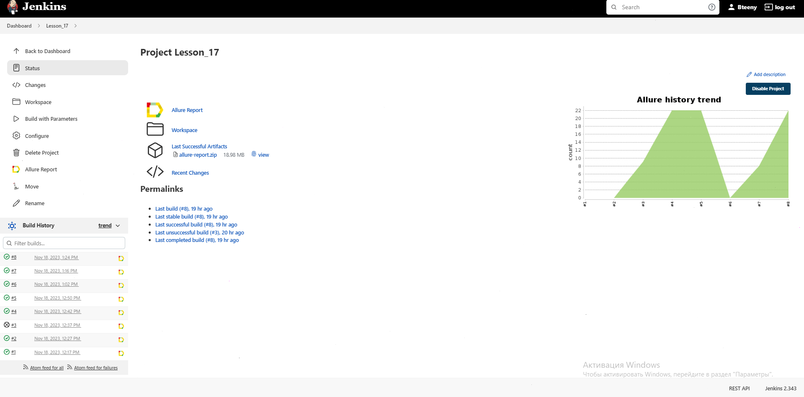
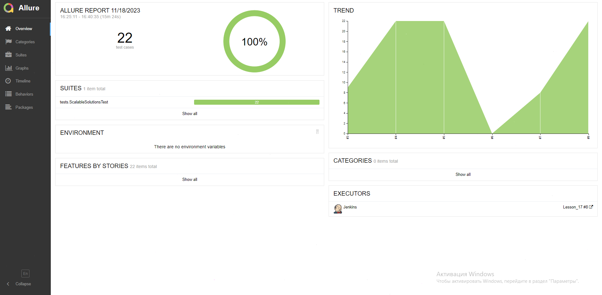
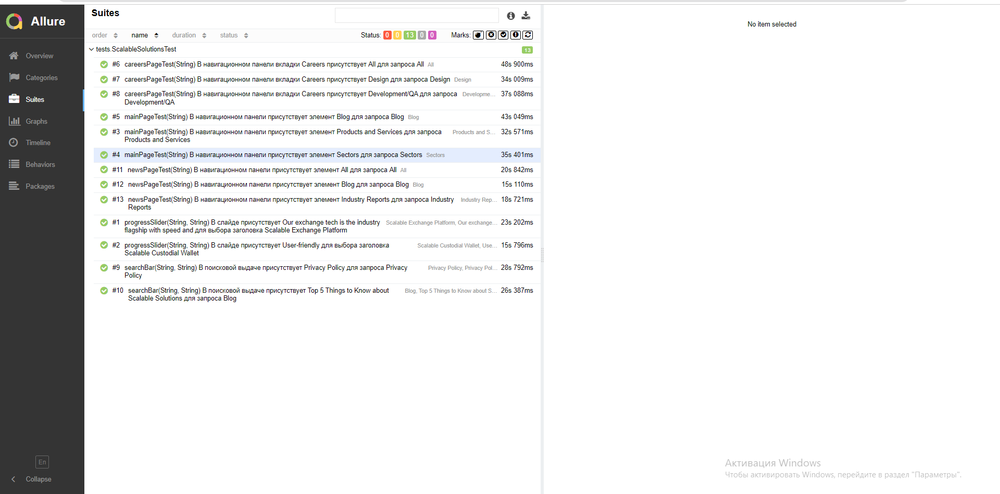
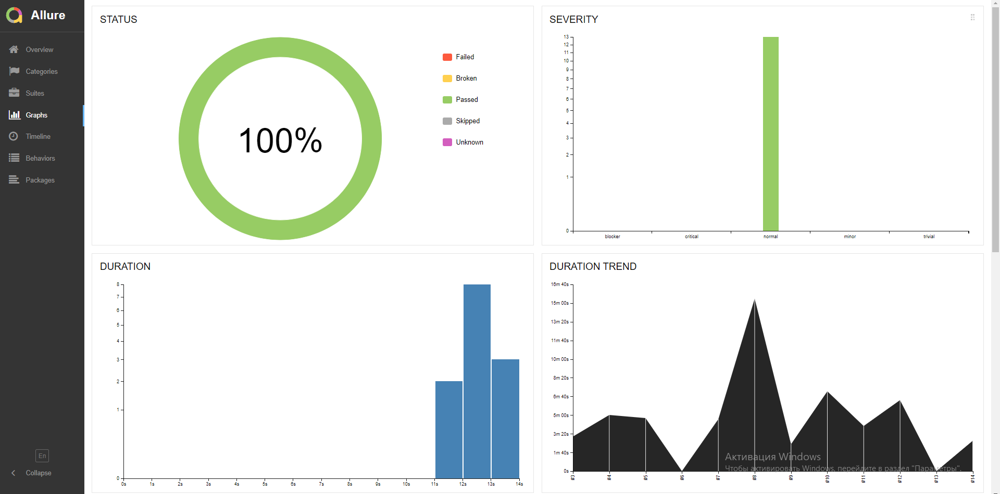
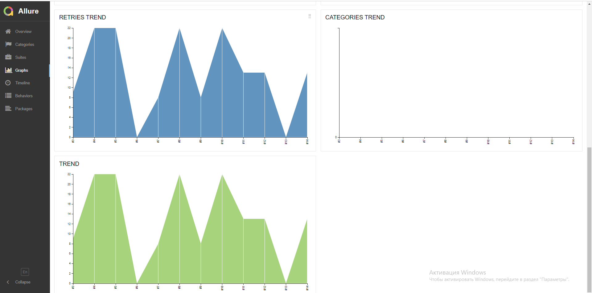
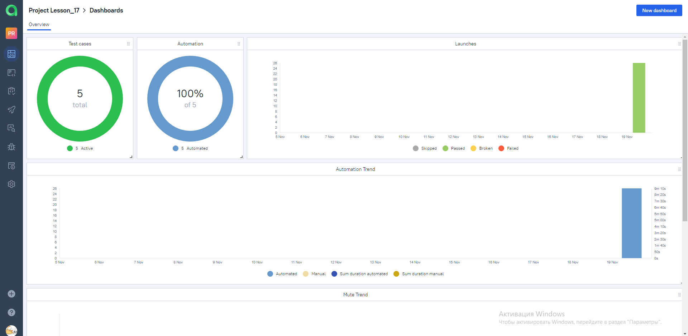
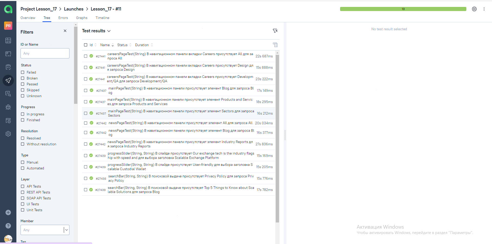
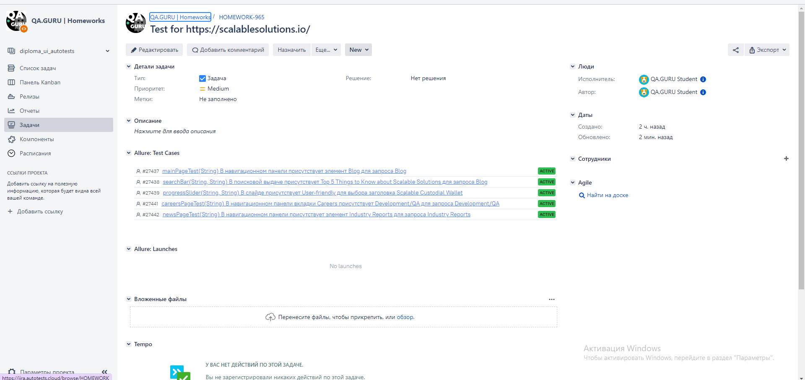
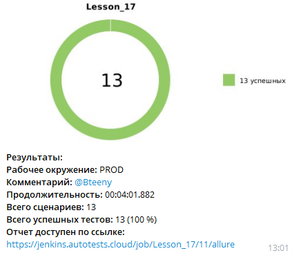

# Проект по автоматизации тестовых сценариев для проекта [Scalable](https://scalablesolutions.io/)
##  Содержание:

* <a href="#tools">Технологии и инструменты</a>

* <a href="#cases">Примеры автоматизированных тест-кейсов</a>

* <a href="#jenkins">Сборка в Jenkins</a>

* <a href="#console">Запуск из терминала</a>

* <a href="#allure">Allure отчет</a>

* <a href="#allure-testops">Интеграция с Allure TestOps</a>

* <a href="#jira">Интеграция с Jira</a>

* <a href="#telegram">Уведомление в Telegram при помощи бота</a>

* <a href="#video">Примеры видео выполнения тестов на Selenoid</a>

<a id="tools"></a>
## :computer: Использованный стек технологий

<p align="center">
<a href="https://www.jetbrains.com/ru-ru/idea/"></a>
<a href="https://www.java.com/"></a>
<a href="https://selenide.org/"></a>
<a href="https://aerokube.com/selenoid/latest/"></a>
<a href="https://allurereport.org/"></a>
<a href="https://qameta.io/"></a>
<a href="https://gradle.org/"></a>
<a href="https://junit.org/junit5/docs/current/user-guide/"></a>
<a href="https://github.com/"></a>
<a href="https://www.jenkins.io/"></a>
<a href="https://web.telegram.org/"></a>
<a href="https://www.atlassian.com/ru/software/jira"></a>
</p>

<a id="cases"></a>
## <a name="Примеры автоматизированных тест-кейсов">**Примеры автоматизированных тест-кейсов:**</a>
____
- ✓ *Проверка слайдов на главной странице*
- ✓ *Проверка работы поиска*
- ✓ *Проверка вкладок на главной странице*
- ✓ *Проверка вкладок в странице 'Blog'*
- ✓ *Проверка вкладок в странице 'Careers'*

<a id="jenkins"></a>
## </a><a name="Сборка"></a>Сборка в [Jenkins](https://jenkins.autotests.cloud/job/Lesson_17/)</a>
____
<p align="center">  
<a href="https://jenkins.autotests.cloud/job/Lesson_17/"></a>  
</p>


### **Параметры сборки в Jenkins:**

- *browserName (браузер, по умолчанию chrome)*
- *browserVersion (версия браузера, по умолчанию 100.0)*
- *browserSize (размер окна браузера, по умолчанию 1920x1080)*
- *selenoidAddress (адрес удаленного сервера Selenoid)*

<a id="console"></a>
## Команды для запуска из терминала
___
***Локальный запуск :***
```bash  
gradle clean scalablesolutions_test -Dlaunch=local
```
***Удаленный запуск в Selenoid :***
```bash  
gradle clean scalablesolutions_test -Dlaunch=remote
```

***Удалённый запуск через Jenkins :***
```bash  
clean scalablesolutions_test
"-DbrowserName=${browserName}"
"-DbrowserVersion=${browserVersion}"
"-DbrowserSize=${browserSize}"
"-DselenoidAddress=${selenoidAddress}"
```
<a id="allure"></a>
##  Allure [отчет](https://jenkins.autotests.cloud/job/Lesson_17/12/allure/)
### *Основная страница отчёта*

<p align="center">

</p>

### *Тест-кейсы*

<p align="center">

</p>

### *Графики*

  <p align="center">  


  


<a id="allure-testops"></a>
##  Интеграция с [Allure TestOps](https://allure.autotests.cloud/project/3812/dashboards)
### *Allure TestOps Dashboard*

<p align="center">  
  
</p> 

### *Авто тест-кейсы*

<p align="center">  
  
</p>

<a id="jira"></a>
## </a> Интеграция с <a target="_blank" href="https://jira.autotests.cloud/browse/HOMEWORK-965">Jira</a>
____
<p align="center">  
  
</p>

<a id="telegram"></a>
## </a> Уведомление в Telegram при помощи бота
____
<p align="center">  
  
</p>

____
<a id="video"></a>
## </a> Примеры видео выполнения тестов на Selenoid
____
<p align="center">
   
</p>